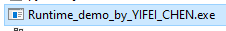
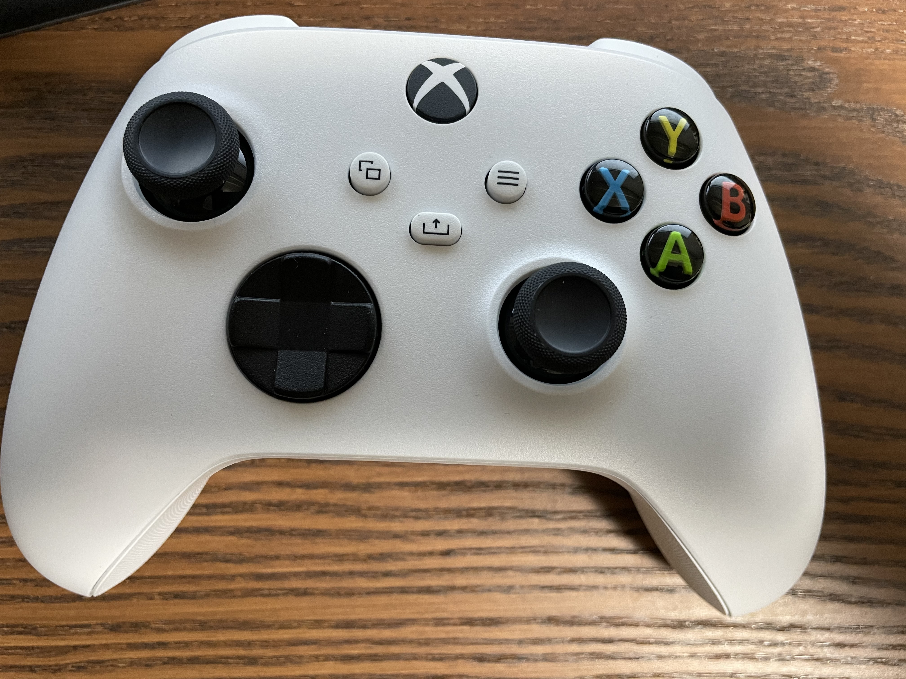
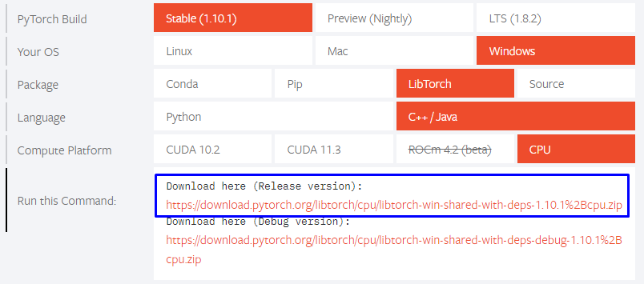

# FFAC
This is a Demo reporsitory of our Fourier Feature Character Animation Controller which only contains the code are necessary for running the demo\
Full source code are not public yet
## Preview

## How to use
### Demo
If you just want to run the demo program without worring about the source code, simply run `Demo/Runtime_demo_by_YIFEI_CHEN.exe` on Windows.\

### How to control
I strongly recommend you to have a controller ready on your computer, though you still can use keyboard to control the character, but the visual result is not as good as using controller. Theoretically any controller that can connect to Windows system should work, I tested with XBOX gamepad and it works fine. Different controller may have various button mapping and in that case the control keys could be different. \


**Gamepad Control**
- Leftstick              - Moving Direction
- Rightsitck             - Camera Direction
- LT (HOLD) + Rightstick - Facing Direction
- RT (HOLD)              - Switch to Run

**Keyboard Control**
- W S A D (HOLD)                 - Moving Direction
- ALT (HOLD) + Leftclick (HOLD)  - Camera Direction
- X                              - Stop
- F                              - Switch to Run/Walk

## Build from Source
If you want to build the source code, you should follow the instructions below/
-  Run `git submodule update --init` to install all required submodules
-  (Linux) Build the required package and place them in `3rd_party/glfw` and `3rd_party/libtorch`
-  (Windows) Download the pre-complied [GLFW](https://www.glfw.org/download) and [Libtorch](https://pytorch.org/) and place them in `3rd_party/glfw` and `3rd_party/libtorch`


**Now your `3rd_party` directory should look like this**

```
3rd_party
│   FindEigen3.cmake
│   FindGLFW.cmake
│
└───delfem2
└───eigen
└───glfw
└───imguiglfw
│  
│   
└───libglfw
│   │   docs
│   │   include
│   │   lib-mingw-w64
│   │   lib-static-ucrt
│   └── ....
│   
└───libtorch
│   │   bin
│   │   cmake
│   │   include
│   └── ....
│   
```

- (Windows) Go to `Source/` run `cmake -S . - B build` the Vistual Studio files will be inside the `build/` folder.
- (Linux) Build the cmake file in `Source` folder and make sure you complie in release mode
