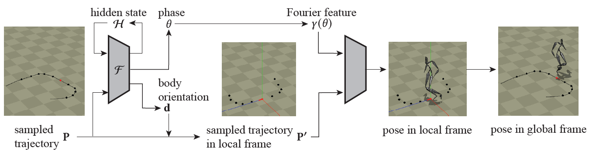
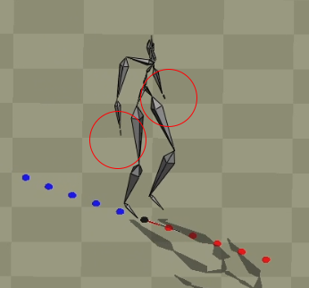
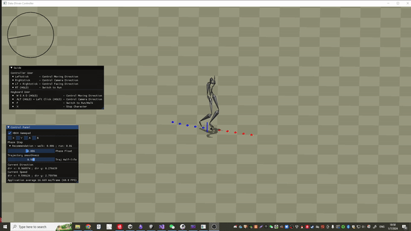
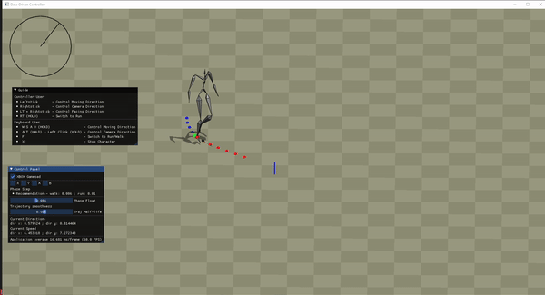
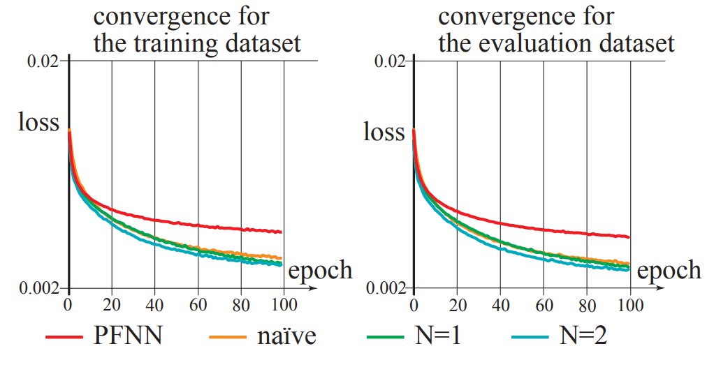
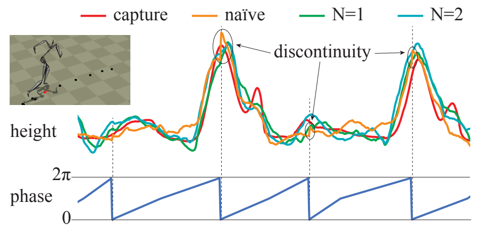
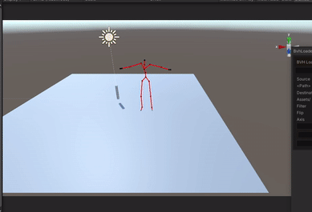
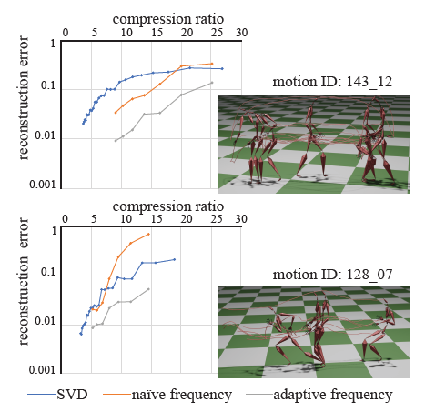

# FFAC  Fourier Feature Animation Controller
Contents - 目次
- [Introduction](#introduction)
- [Preview](#preview)
- [How to run](#how-to-use)
  - [Demo](#demo)
- [How to control](#how-to-control)
- [Build from Source](#build-from-Source)
- [Unity Implementation](#unity-implementation)
- [Thoughts and Future Improvement](#thoughts-and-future-improvement)

**Relative  Paper**
1. [Neural Motion Compression with Frequency-adaptive Fourier Feature Network](https://cgenglab.github.io/labpage/en/publication/eg22short_neuralcompression/)
2. [Phase-Functioned Neural Networks for Character Control](http://www.ipab.inf.ed.ac.uk/cgvu/phasefunction.pdf)

## Introduction
This repository contains large files, e.g. Demo/torch_cpu.dll (210.4MB). In order to clone this repository including the complete zip files, you need to use [git lfs](https://github.com/git-lfs/git-lfs/wiki/Installation).\
*Clone the repository may take 8-15 minutes depends on your Internet connection*

This is a Demo reporsitory of our Fourier Feature Character Animation Controller which only contains the code are necessary for running the demo\
Required Libraries
```
glfw
delfem2
eigen
imgui
libtorch
```
**Network**\

**Overview**\

**Input and Output**\
One significant difference between our current method and previous data-driven appraoches is that we only used phase,orientation and trajecotry positions as input and output the full body pose data. Input is size 24 including 5 future trajectory, 5 past trajectory samples, phase, and body-orientation vector. Preivous data-driven methods usually have a input size > 200 with preivous frame joint information, future/past trajectory, and gait. \
It is true that our current visual result definitely not better than any of previous approaches, but with adding more inputs I think we could achieve a considerably less "foot sliding" animation.\
**IK for disconnected joints**\
Because the FFAC network will predict both the local translation and rotation related to the root bone, some of the joints, such as hands and feet joints, may disconnected from their parent bone because their local position is far from root bone, the network predicted local position will have a slightly larger error on those joints. 
\
One of the solutions is to apply the full-body IK. In our case, we used CCD IK. The disconnected joints will be reconnected. 
\
**Implement IK for foot lock (WIP)**\
The predicted animation also has a foot sliding issue where the predicted foot position does not perfectly match the trajectory speed.
\
By implementing IK to leg-ankle joints, and combining the foot locking feature we may fix the foot sliding problem. 
First, we compute the speed of both foot joints, when the speed is slower than the specific threshold $S_{threshold} = 1.5$. We lock the foot and apply 2 joints IK to the leg-angle joints. 
The red sphere is the foot joint's position and the green sphere in the video shows the IK's target. IK will be applied when the green sphere appears. 
(WIP) To make the animation have a more smooth transition between IK and predicted animation, we shall interpolate the animation when we apply or disable IK. This part is still working in progress. 
\
**Memory Comparsion**
|        | Motion Data | Our FFAC network | PFNN             |
|--------|-------------|------------------|------------------|
| Memory | 265MB       | 1.5MB            |>5MB               |

\
\
**Evaluation** *(Models have same size of parameters)*\
\



## Preview
<!-- \ -->
<!--  -->

## How to use
### Demo
If you just want to run the demo program without worring about the source code, simply run `Demo/Runtime_demo_by_YIFEI_CHEN.exe` on Windows.\

### How to control
I strongly recommend you to have a controller ready on your computer, though you still can use keyboard to control the character, but the visual result is not as good as using controller. Theoretically any controller that can connect to Windows system should work, I tested with XBOX gamepad and it works fine. Different controller may have various button mapping and in that case the control keys could be different. \


**Gamepad Control**
```
- Leftstick              - Moving Direction
- Rightsitck             - Camera Direction
- LT (HOLD) + Rightstick - Facing Direction
- RT (HOLD)              - Switch to Run
```
**Keyboard Control**
```
- W S A D (HOLD)                 - Moving Direction
- ALT (HOLD) + Leftclick (HOLD)  - Camera Direction
- X                              - Stop
- F                              - Switch to Run/Walk
```
## Build from Source
If you want to build the source code, you should follow the instructions below
-  **Step 1** Run `git submodule update --init` to install all required submodules
-  **Step 2** (Linux) Build the required package and place them in `3rd_party/glfw` and `3rd_party/libtorch`
-  **Step 2** (Windows) Download the pre-complied [GLFW](https://www.glfw.org/download) and [Libtorch](https://pytorch.org/) and place them in `3rd_party/glfw` and `3rd_party/libtorch`


**Now your `3rd_party` directory should look like this**

```
3rd_party
│   FindEigen3.cmake
│   FindGLFW.cmake
│
└───delfem2
└───eigen
└───glfw
└───imguiglfw
│  
│   
└───libglfw
│   │   docs
│   │   include
│   │   lib-mingw-w64
│   │   lib-static-ucrt
│   └── ....
│   
└───libtorch
│   │   bin
│   │   cmake
│   │   include
│   └── ....
│   
```

- **Step 3**(Linux) Build the cmake file in `Source` folder and make sure you complie in release mode
- **Step 3**(Windows) Go to `Source/` run `cmake -S . -B build` the cmake will generate the Vistual Studio solution files inside the `build/` folder.

## Unity Implementation
Currently I'm trying to implement the idea in Unity engine. \
Still working on it.\
\
**TODO**
- [x] Build a .BVH loader 
- [ ] Implement trajectory system
- [ ] Implement NN model
- [ ] Implement the full controller

## Thoughts and Future Improvement
\
As shown in the video above, when we train the neural network with a higher frequency fourier feature, the output animation data performs jitter and shaking result. Our assumption is the current motion data doesn't contain any high frequency information (the joint angles change rapidly between frames). Walking and running are considered as low frequency animation while increasing the fourier mapping freq doesn't help at all, but it did slightly improve the accuracy of animation when feet touching ground despite of the jitter frames. Frequncy choosing would be a key in order to make this research idea becoming more convincible. 

\
In our paper [Neural Motion Compression with Frequency-adaptive Fourier Feature Network](https://cgenglab.github.io/labpage/en/publication/eg22short_neuralcompression/), picking dominate frequency from DCT of the motion gives significantly better result. I think in FFAC, in stead of feeding frequencies 1,2,3...., we could predict the ideal frequency for current animation based on the future and past trajectory. It means we could predict a dominated frequency based on the trajectory. This may give us better result. 
