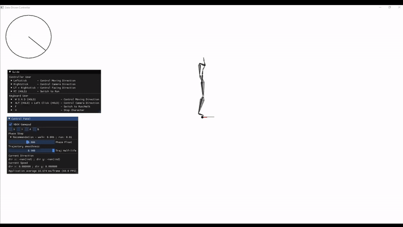

# FFAC  Fourier Feature Animation Controller

*Clone the repository may take 8-15 minutes depends on your Internet connection* \
This is a Demo reporsitory of our Fourier Feature Character Animation Controller which only contains the code are necessary for running the demo\
Full source code are not public yet\
Required Libraries
```
glfw
delfem2
eigen
imgui
libtorch
```
**Input and Output**\
One significant difference between our current method and previous data-driven appraoches is that we only used phase,orientation and trajecotry positions as input and output the full body pose data. Input is size 24 including 5 future trajectory, 5 past trajectory samples, phase, and body-orientation vector. Preivous data-driven methods usually have a input size > 100 with preivous frame joint information, future/past trajectory, and gait. \
It is true that our current visual result definitely not better than any of previous approaches, but with adding more inputs I think we could achieve a considerably less "foot sliding" animation.\
**Memory Comparsion**
|        | Motion Data | Our FFAC network | PFNN             |
|--------|-------------|------------------|------------------|
| Memory | 265MB       | 1.5MB            |>5MB               |

\
\
**Evaluation** *(Models have same size of parameters)*\
\


## Preview

## How to use
### Demo
If you just want to run the demo program without worring about the source code, simply run `Demo/Runtime_demo_by_YIFEI_CHEN.exe` on Windows.\

### How to control
I strongly recommend you to have a controller ready on your computer, though you still can use keyboard to control the character, but the visual result is not as good as using controller. Theoretically any controller that can connect to Windows system should work, I tested with XBOX gamepad and it works fine. Different controller may have various button mapping and in that case the control keys could be different. \


**Gamepad Control**
```
- Leftstick              - Moving Direction
- Rightsitck             - Camera Direction
- LT (HOLD) + Rightstick - Facing Direction
- RT (HOLD)              - Switch to Run
```
**Keyboard Control**
```
- W S A D (HOLD)                 - Moving Direction
- ALT (HOLD) + Leftclick (HOLD)  - Camera Direction
- X                              - Stop
- F                              - Switch to Run/Walk
```
## Build from Source
If you want to build the source code, you should follow the instructions below
-  **Step 1** Run `git submodule update --init` to install all required submodules
-  **Step 2** (Linux) Build the required package and place them in `3rd_party/glfw` and `3rd_party/libtorch`
-  **Step 2** (Windows) Download the pre-complied [GLFW](https://www.glfw.org/download) and [Libtorch](https://pytorch.org/) and place them in `3rd_party/glfw` and `3rd_party/libtorch`


**Now your `3rd_party` directory should look like this**

```
3rd_party
│   FindEigen3.cmake
│   FindGLFW.cmake
│
└───delfem2
└───eigen
└───glfw
└───imguiglfw
│  
│   
└───libglfw
│   │   docs
│   │   include
│   │   lib-mingw-w64
│   │   lib-static-ucrt
│   └── ....
│   
└───libtorch
│   │   bin
│   │   cmake
│   │   include
│   └── ....
│   
```

- **Step 3**(Linux) Build the cmake file in `Source` folder and make sure you complie in release mode
- **Step 3**(Windows) Go to `Source/` run `cmake -S . -B build` the cmake will generate the Vistual Studio solution files inside the `build/` folder.

